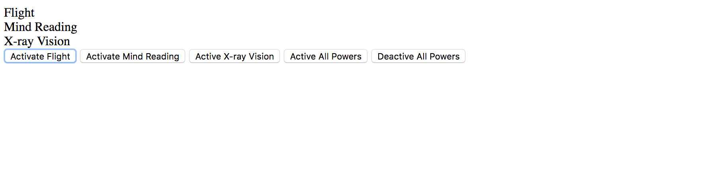

# Event Listeners

This project is an exploration of event listeners. I did some practice and watched the videos by Steve Brownlee. Experimented with clicks, mouse overs, key presses, etc.

## Screenshots


## How to run this project
* Use npm to install http-server in your terminal: 
```sh
npm install -g http-server
```
* Run the server
```sh
hs -p 9999
```
* Open chrome and navigate to: 
```
localhost: 9999
```